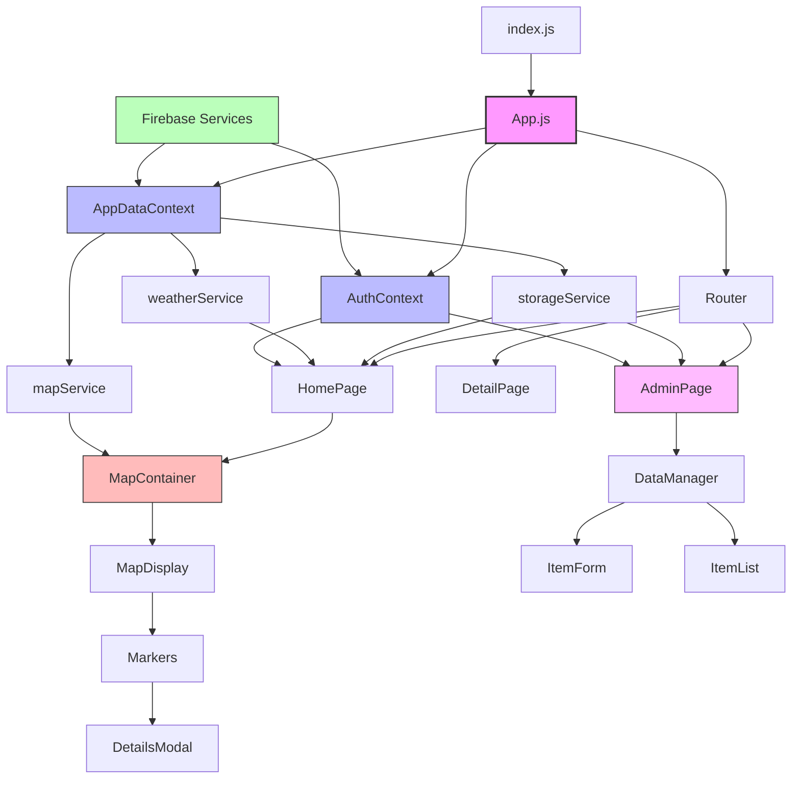
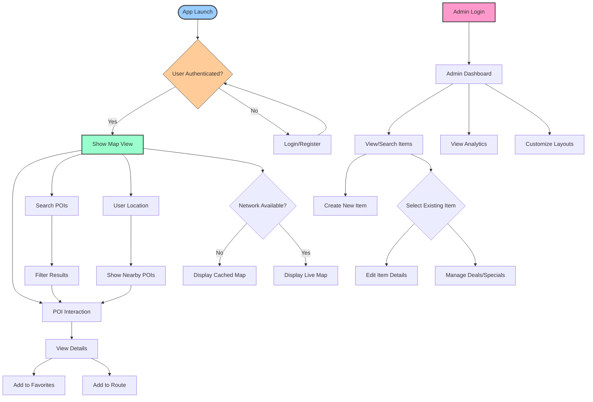
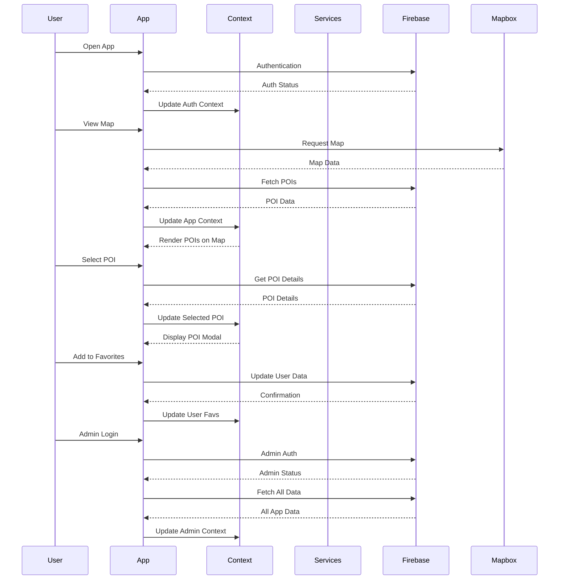

# MAHALO App Flow Diagrams

## Application Architecture

```mermaid
graph TD
    %% Core Application Components
    A[index.js] --> B[App.js]
    B --> C[Router]
    
    %% Contexts
    B --> D[AuthContext]
    B --> E[AppDataContext]
    
    %% Main Routes
    C --> F[HomePage]
    C --> G[AdminPage]
    C --> H[DetailPage]
    
    %% Firebase Services
    I[Firebase Services] --> D
    I --> E
    
    %% Map Integration
    F --> J[MapContainer]
    J --> K[MapDisplay]
    K --> L[Markers]
    L --> M[DetailsModal]
    
    %% Data Services
    E --> N[mapService]
    E --> O[storageService]
    E --> P[weatherService]
    
    %% Admin Features
    G --> Q[DataManager]
    Q --> R[ItemForm]
    Q --> S[ItemList]
    
    %% Data Flow
    N --> J
    O --> F
    O --> G
    P --> F
    
    %% Authentication Flow
    D --> F
    D --> G
    
    style B fill:#f9f,stroke:#333,stroke-width:2px
    style D fill:#bbf,stroke:#333,stroke-width:1px
    style E fill:#bbf,stroke:#333,stroke-width:1px
    style I fill:#bfb,stroke:#333,stroke-width:1px
    style J fill:#fbb,stroke:#333,stroke-width:1px
    style G fill:#fbf,stroke:#333,stroke-width:1px
```

## User Flow

```mermaid
flowchart TD
    Start([App Launch]) --> Auth{User Authenticated?}
    Auth -->|Yes| Map[Show Map View]
    Auth -->|No| Login[Login/Register]
    Login --> Auth
    
    Map --> POI[POI Interaction]
    POI --> Details[View Details]
    Details --> Favorite[Add to Favorites]
    Details --> Route[Add to Route]
    
    Map --> Search[Search POIs]
    Search --> Filter[Filter Results]
    Filter --> POI
    
    Map --> UserLoc[User Location]
    UserLoc --> Nearby[Show Nearby POIs]
    Nearby --> POI
    
    Map --> OfflineMode{Network Available?}
    OfflineMode -->|No| CachedMap[Display Cached Map]
    OfflineMode -->|Yes| LiveMap[Display Live Map]
    
    Admin[Admin Login] --> Dashboard[Admin Dashboard]
    Dashboard --> ItemList[View/Search Items]
    ItemList --> CreateItem[Create New Item]
    ItemList --> SelectItem{Select Existing Item}
    SelectItem --> EditItem[Edit Item Details]
    SelectItem --> ManageDeals[Manage Deals/Specials]
    Dashboard --> ViewAnalytics[View Analytics]
    Dashboard --> CustomizeLayouts[Customize Layouts]
    
    style Start fill:#9cf,stroke:#333,stroke-width:2px
    style Auth fill:#fc9,stroke:#333,stroke-width:1px
    style Map fill:#9fc,stroke:#333,stroke-width:2px
    style Admin fill:#f9c,stroke:#333,stroke-width:2px
```

## Data Flow

```mermaid
sequenceDiagram
    participant U as User
    participant A as App
    participant C as Context
    participant API as Services
    participant FB as Firebase
    participant MB as Mapbox
    
    U->>A: Open App
    A->>FB: Authentication
    FB-->>A: Auth Status
    A->>C: Update Auth Context
    
    U->>A: View Map
    A->>MB: Request Map
    MB-->>A: Map Data
    A->>FB: Fetch POIs
    FB-->>A: POI Data
    A->>C: Update App Context
    C-->>A: Render POIs on Map
    
    U->>A: Select POI
    A->>FB: Get POI Details
    FB-->>A: POI Details
    A->>C: Update Selected POI
    C-->>A: Display POI Modal
    
    U->>A: Add to Favorites
    A->>FB: Update User Data
    FB-->>A: Confirmation
    A->>C: Update User Favs
    
    U->>A: Admin Login
    A->>FB: Admin Auth
    FB-->>A: Admin Status
    A->>FB: Fetch All Data
    FB-->>A: All App Data
    A->>C: Update Admin Context
``` 